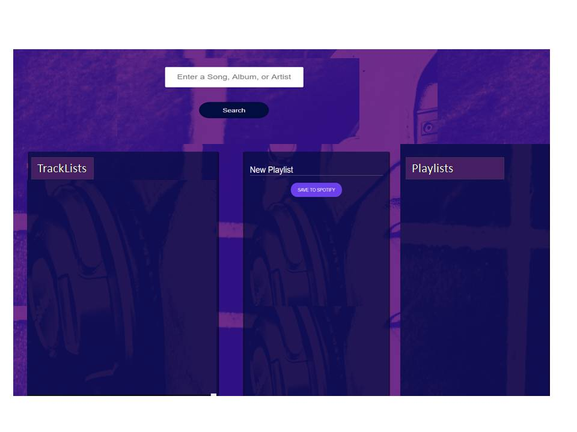

## Feature Request: Explore Genres/Moods
November 10th 2017
Tony Shannon

# OBJECTIVE
The aim of this feature is to be able to improve Jamming by searching for Genres/Mood from Spotify, explore related playlists, select a playlist to explore tracks within..plus add to a new user playlist if needed. 

# BACKGROUND 
The React Jammer application developed to date is useful and shows what can be done via API services. However the functionality is limited.
One of my favourite features in Spotify is to explore genres and playlists to find music to meet my mood. So I wish to extend Jammer towards addressing this need. The key features of this feature will involve;
	Search for Genre/Mood by Keyword (eg Dinner)
	Listing of Genre/Mood Playlists 
	Select a Playlist from the Genre/Mood (eg Jazzy Dinner) 
	Explore Tracks on that Playlist
	Add Tracks from the Spotify Mood/Genre playlist to add to user playlist 

This feature involves a new aspect to Spotify API  that combines categories, playlists, tracks etc that extend the functionality of the Jamming application while extending its capability in new ways. It is a precursor to a further step that will allow for playing tracks, which should be tackled as a separate feature.

# TECHNICAL DESIGN
The approach taken here is to reuse and build on much of the functionality we have already built, ie Search Bar, Search Results, TrackLists, Tracks and Playlists.
We will step through the changes needed to Jammer to explain the approach to this feature development.
## Start Up
The Jammer application will start as normal

## SearchBar
In the searchbar, we add a new feature, where we allow users to search for a genre, we can do this via either a syntax search trigger for now eg Search for “Mood:Dinner” or perhaps a radio button beside the SearchBar to signify a Mood/Genre search. 
For the sake of simplicity and a clean UI, we will further develop the search functionality to process this search.  We will prefill the search bar to explain how to search by Mood/Genre.

We will need to check the search string for “Mood” (with a regex search) and if so it will need to change the search to a lowercase (eg Dinner to dinner) then trigger a Spotify search based on the Search by Category API
SearchBar.js search() will take the search (term) and pass it to App.js
App.js search(term) will take that search (term), & need amendment to cater for “Mood:”  and add an if statement that will route the to Spotify search by category API if Mood: is included and pass it to search(category)
Spotify.js search(term) takes the search term from App.js as normal
Spotify.js will need a new method.. search(category) that will leverage/learn from the search(term) and pass several details esp the authentication token and the category and will then handle the jsonResponse including the Playlist id, name and uri

## Search By Category API: See here for explanation of this method:
https://api.spotify.com/v1/browse/categories/{category_id}/playlists
This Search By Category API will provide a listing of available Playlists to the user, the result set includes the playlists of this format
In our case, the category id is taken from the “Mood:Dinner” and ends up as “dinner”

This Search By Category API provides a listing of available Playlists to the user, the result set includes the playlists of this format
`
{
      "collaborative" : false,
      "external_urls" : {
        "spotify" : "https://open.spotify.com/user/spotify/playlist/37i9dQZF1DX4xuWVBs4FgJ"
      },
      "href" : "https://api.spotify.com/v1/users/spotify/playlists/37i9dQZF1DX4xuWVBs4FgJ",
      "id" : "37i9dQZF1DX4xuWVBs4FgJ",
      "images" : [ {
        "height" : 300,
        "url" : "https://i.scdn.co/image/438f9b65ac4eb48681351593142daeb070986293",
        "width" : 300
      } ],
      "name" : "Dinner with Friends",
      "owner" : {
        "display_name" : "Spotify",
        "external_urls" : {
          "spotify" : "https://open.spotify.com/user/spotify"
        },
        "href" : "https://api.spotify.com/v1/users/spotify",
        "id" : "spotify",
        "type" : "user",
        "uri" : "spotify:user:spotify"
      },
      "public" : null,
      "snapshot_id" : "4Kxz1FSNbBDnZD2KcdXO5V75fqvqBhUyvp9kr+LT1/KfxN/4W+sI7XE8/yDT09tzoPPKJ06F1VU=",
      "tracks" : {
        "href" : "https://api.spotify.com/v1/users/spotify/playlists/37i9dQZF1DX4xuWVBs4FgJ/tracks",
        "total" : 80
      },
      "type" : "playlist",
      "uri" : "spotify:user:spotify:playlist:37i9dQZF1DX4xuWVBs4FgJ"
    }, 
    `
    
To accommodate the playlist we will add a third column to the frontend, called Playlists
App.js will need to be amended to;
	
Access the Search(Category) method in Spotify.js to get the PlayListList object, something like this;
  `search(category) {
    Spotify.search(category).then(PlayListListResults => {
      this.setState({PlayListListResults: PlayListListResults});
    });
  }`
Import a PlayListList Component
	Render the new component PlayListList
This will require 3 new files
1) PlayListListResults.js .. modelled on SearchResults.js

	The key difference will be
`class PlayListListResults extends React.Component {
  render() {
    return (
      

        <h2>PlayLists:</h2>
        <PlayListList tracks={this.props.PlayListListResults}/>
      

    );
  }
}`

2) PlaylistList.js   .. modelled on the TrackList.js .. the key will be playlist.id, playlist.name and playlist.uri
3) PlaylistList.css   .. modelled on TrackList.css
From the PlayListList (in this case “mood:dinner”) we then select a playlist (eg “Dinner for Two”) to explore further;

We then take the Playlist id field (   "id" : "37i9dQZF1DX4xuWVBs4FgJ" )here and pass it to the next API call

## Spotify Get a Playlist API  
https://api.spotify.com/v1/users/{user_id}/playlists/{playlist_id}
The owner/user_id here is spotify
The playlist_id here is 37i9dQZF1DX4xuWVBs4FgJ

App.js and Spotify.js will need new methods to process the getPlaylist methods

The Spotify.js getPlayListTracks method will be based on the search(term) method, it will take the “spotify” as userid and the selected playlistID as a parameter and call on the https://api.spotify.com/v1/users/{user_id}/playlists/{playlist_id} API

The App.js file will take the resulting playlist tracks , set them to state and render them via the TrackList and Track components 

That then returns a tracklist with a list of tracks of this format
https://gist.github.com/tony-shannon/35c3fd8849fbb31035f78eb77016c185

## Explore TrackLists
We reuse the Tracklist and Track functionality already developed to provide a list of related tracks to  the user as already available

i.e. again we list the tracks from that playlist with the following data in the tracks:
track.id, track.name, track.artists[0].name, track.album.name, track.uri

## Add/Save to User Playlist
The user can then choose to add a track to a new playlist of their own, as in our original application.

They can then save a new playlist to their own account, again as previously available in the application

# CAVEATS
This section is used to lay out alternative solutions and their respective drawbacks, as well as potential drawbacks to the proposed solution above. This is used to make it clear why the technical implementation detailed previously was chosen instead of alternatives. It additionally allows stakeholders or other developers to consider those drawbacks and choose one of the alternate solutions if they prefer it. This may occur if they feel the benefits or drawbacks of that solution are more desirable than the current solution, or if they can identify other benefits and drawbacks not currently listed.
The feature outlined here progresses and improves the functionality of the Jamming application, while keeping the changes to a reasonable scope, so the work involved is a step wise improvement.

The changes are at both the UI level as well as needing to call 2 new APIs
The search style involving “Mood:Dinner” as search syntax is not the most user friendly, but has the advantage of being simple enough to support, with a check/parse on the search term. It keeps the UI fairly clean without added buttons etc.
The UI change involved with the new component is PlayListList may be done in other ways, though in the authors view having PlayLists and TrackLists sitting side by side is pretty clean and useful/reusable pattern.

The user flow runs from Search to Exploring PlayListLists to Exploring TrackLists, then reusing Tracklists to create(+/- amending) Playlists.. 

Sitting PlayLists alongside PlayListLists could be confusing, but that is mitigated by making the PlayListList Readonly (non editable) while allowing the PlayLists to be Read/Write (ie editable)
